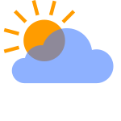

<!-- Language Selector -->
[English](README.en.md) | [**Русский**](README.md)
<!-- End Language Selector -->

<h3> SimpleTV Addons </h3>
<h4>

This is a repository that contains publications of addon releases for the SimpleTV IPTV player for the Windows OS.
 Visit <a href="http://sergeyvs012.rf.gd/">SimpleTV website</a>.

At the moment, 2 addons are being published here: <b>TVSources</b> and <b>Weather</b>. 
Suggestions and errors are considered on 👉<a href="http://sergeyvs012.rf.gd/bugtracker/view_all_bug_page.php"> the bugtracker.</a>

</h4>

Scrapers for addon can be taken from 👉<a href="https://github.com/Nexterr-origin/simpleTV-Scripts">Nexterr repository</a>

 
Donate for morning :coffee: 

  
 
  <i><small>
  🤝DonationAlerts: https://www.donationalerts.com/r/bmsimpletv 
  </small></i>
  
  

  <i><small>
  🤝YooMoney wallet: https://yoomoney.ru/to/410012004830397  
  </small></i>
  
  

  

